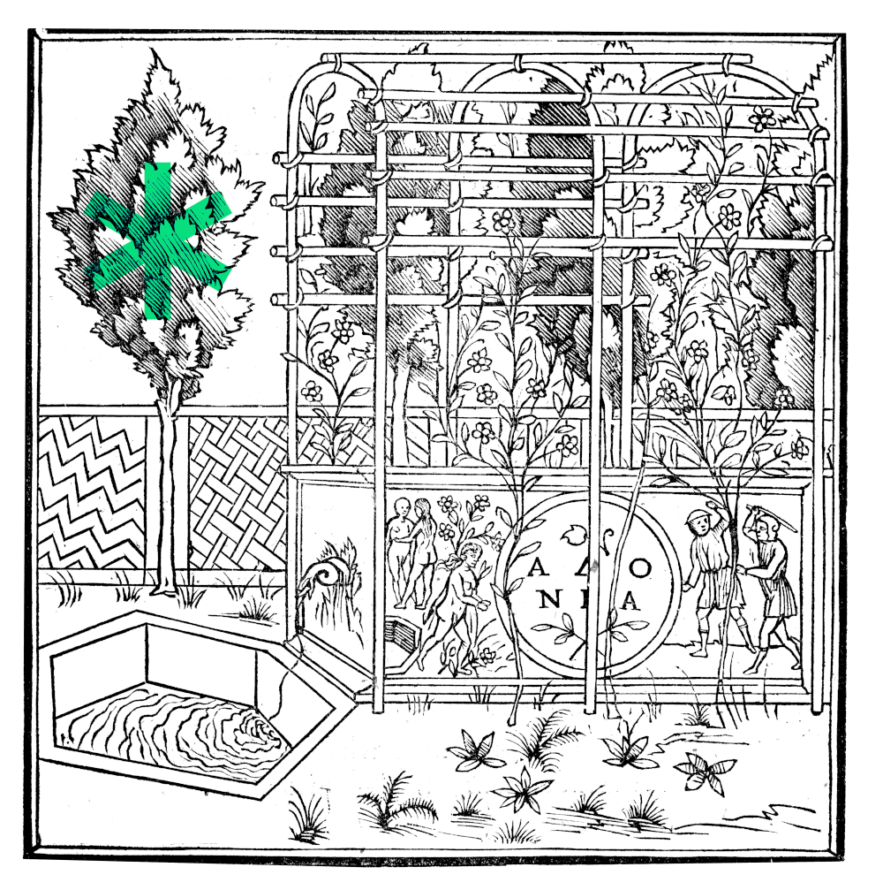

# Hypnerotomachia Poliphili

<p align=center>
📖<br>
One of the first work of printing,<br>
published by Alde Manuce,<br>
in 1499’s Venise,<br>
re-edited today<br>
in Next.js<br>
⁎ ⁎ ⁎<br>
⁎ ⁎<br>
⁎
</p>

<p align=center>
<a href="https://eliseduverdier.github.io/hypnerotomachia-poliphili/"><strong>Read here</strong></a>
<br><br>

</p>

## tech stack
* Next.js
* Notion API
```sh
$ make start # for docker
$ make install # first time
$ make run # -> http://localhost:3000/hypnerotomachia-poliphili
```

## sources

-   [Wikipedia](https://en.wikipedia.org/wiki/Hypnerotomachia_Poliphili)
-   [French text](<https://fr.wikisource.org/wiki/Le_Songe_de_Poliphile_(%C3%A9d._Popelin,_1883)>)
-   [Latin text](http://www.liberliber.it/mediateca/libri/c/colonna/hypnerotomachia_poliphili_etc/pdf/hypner_p.pdf)
-   [Scanned book](http://architectura.cesr.univ-tours.fr/Traite/Images/LES1358Index.asp)
-   [Illustrations](https://gallica.bnf.fr/ark:/12148/btv1b2200005d)
